# 🚀 AWS EC2 Infrastructure with Terraform

<div align="center">


*Deploy a complete AWS infrastructure with VPC, subnets, security groups, and EC2 instance running Nginx*

</div>

---

## 🏗️ Architecture Overview

```mermaid
graph TB
    Internet([🌐 Internet])
    IGW[🚪 Internet Gateway]
    VPC[☁️ VPC<br/>10.0.0.0/16]
    RT[📋 Route Table]
    SG[🛡️ Security Group<br/>SSH:22, HTTP:80, HTTPS:443]
    Subnet[🏠 Public Subnet<br/>10.0.1.0/24]
    EC2[🖥️ EC2 Instance<br/>Ubuntu 22.04 + Nginx]
    
    Internet --> IGW
    IGW --> VPC
    VPC --> RT
    VPC --> Subnet
    RT --> Subnet
    SG --> EC2
    Subnet --> EC2
    
    style VPC fill:#ff9999
    style EC2 fill:#99ccff
    style SG fill:#99ff99
```

<div align="center">



</div>

### 📦 Infrastructure Components

| 🔧 Component | 📝 Description | ⚙️ Configuration |
|:-------------|:---------------|:-----------------|
| **🌐 VPC** | Virtual Private Cloud with DNS support | `10.0.0.0/16` |
| **🚪 Internet Gateway** | Provides internet access to public resources | Auto-configured |
| **🏠 Public Subnet** | Subnet with auto-assign public IP | `10.0.1.0/24` |
| **📋 Route Table** | Routes traffic to internet gateway | `0.0.0.0/0 → IGW` |
| **🛡️ Security Group** | Firewall rules for web server | SSH, HTTP, HTTPS |
| **🖥️ EC2 Instance** | Ubuntu server with Nginx | `t2.micro` |

---

## 📋 Prerequisites

<div align="center">

| 🛠️ Tool | 📌 Version | 📝 Description |
|:---------|:-----------|:---------------|
| **AWS CLI** | Latest | Configure with appropriate credentials |
| **Terraform** | >= 1.0 | Infrastructure as Code tool |
| **EC2 Key Pair** | - | Created in your target AWS region |

</div>

---

## ⚙️ Configuration

### 🔧 Variables

> **💡 Tip:** Edit `terraform.tfvars` or modify `variables.tf` defaults to customize your deployment

| 🔧 Variable | 📝 Description | 🎯 Default Value |
|:-------------|:---------------|:----------------|
| `aws_region` | AWS deployment region | `ap-southeast-1` |
| `project_name` | Project name for resource naming | `my-web-app` |
| `vpc_cidr` | CIDR block for VPC | `10.0.0.0/16` |
| `public_subnet_cidr` | CIDR block for public subnet | `10.0.1.0/24` |
| `availability_zone` | Target availability zone | `ap-southeast-1a` |
| `instance_type` | EC2 instance type | `t2.micro` |
| `ami_id` | Ubuntu Server AMI ID | `ami-0b8607d2721c94a77` |
| `key_pair_name` | EC2 Key Pair name | `phonerapterx` |

### 🔑 Key Pair Setup

<div align="center">

> **⚠️ Important:** Ensure you have an EC2 Key Pair before deployment

</div>

```bash
# Create new key pair
aws ec2 create-key-pair --key-name phonerapterx --query 'KeyMaterial' --output text > phonerapterx.pem

# Set proper permissions
chmod 400 phonerapterx.pem
```

---

## 🚀 Usage Guide

### 📦 Deploy Infrastructure

<div align="center">

| Step | Command | Description |
|:----:|:--------|:------------|
| **1** | `terraform init` | Initialize Terraform workspace |
| **2** | `terraform plan` | Review deployment plan |
| **3** | `terraform apply` | Deploy infrastructure |

</div>

```bash
# 1️⃣ Initialize Terraform
terraform init

# 2️⃣ Review the deployment plan
terraform plan

# 3️⃣ Deploy the infrastructure
terraform apply
# Type 'yes' when prompted
```

### 🌐 Access Your Web Server

```bash
# Get the website URL
terraform output website_url

# Example output: http://13.214.123.45
```

### 🔐 SSH Access

```bash
# Connect to your EC2 instance
ssh -i phonerapterx.pem ubuntu@$(terraform output -raw instance_public_ip)
```

### 🗑️ Cleanup Resources

```bash
# Destroy all resources to avoid charges
terraform destroy
# Type 'yes' when prompted
```

---

## 📊 Terraform Outputs

<div align="center">

| 🔍 Output | 📝 Description | 🎯 Usage |
|:----------|:---------------|:---------|
| `vpc_id` | VPC identifier | Reference for other resources |
| `public_subnet_id` | Public subnet identifier | Network configuration |
| `internet_gateway_id` | Internet Gateway identifier | Routing configuration |
| `security_group_id` | Security Group identifier | Firewall rules reference |
| `instance_id` | EC2 instance identifier | Instance management |
| `ami_id` | AMI identifier used | Image reference |
| `instance_public_ip` | Public IP address | Direct access |
| `instance_public_dns` | Public DNS name | Domain access |
| `website_url` | Direct website URL | **🌐 Click to visit!** |

</div>

---

## 🔒 Security Considerations

<div align="center">

> **⚠️ Security Notice**

</div>

| ⚠️ Security Item | 📝 Current Setting | 💡 Recommendation |
|:-----------------|:-------------------|:------------------|
| **SSH Access** | Open to all IPs (`0.0.0.0/0`) | Restrict to your IP range |
| **AMI Updates** | Static AMI ID | Update for different regions |
| **Instance Updates** | Manual updates | Set up automatic security updates |
| **Credentials** | AWS CLI configuration | Use IAM roles when possible |

---

## 📁 Project Structure

```
📦 AWS-IaC-EC2/
├── 🏗️  main.tf              # Main Terraform configuration
├── ⚙️  variables.tf         # Variable definitions  
├── 📊 outputs.tf           # Output definitions
├── 🔧 terraform.tfvars     # Variable values (optional)
├── 🐧 install_nginx.sh     # Nginx installation script
├── 🔒 terraform.tfstate    # Terraform state file
└── 📖 README.md           # This documentation
```

---

## 🔧 Troubleshooting

<div align="center">

| ❌ Issue | 🔍 Cause | ✅ Solution |
|:---------|:---------|:------------|
| **Key Pair Not Found** | Missing key pair in region | Create key pair in target region |
| **AMI Not Available** | Wrong AMI for region | Update AMI ID for your region |
| **Access Denied** | AWS permissions issue | Check credentials and IAM policies |
| **Instance Not Accessible** | Network configuration | Verify security groups and routes |

</div>

---

## 💰 Cost Optimization

<div align="center">

| 💡 Tip | 📝 Description | 💵 Savings |
|:-------|:---------------|:-----------|
| **🆓 Free Tier** | Uses `t2.micro` instance | Eligible for AWS Free Tier |
| **🔄 Resource Management** | Destroy when not needed | Avoid unnecessary charges |
| **📊 Monitoring** | Watch AWS billing dashboard | Track spending regularly |
| **⏰ Scheduling** | Use instance scheduling | Reduce runtime costs |

</div>

---

<div align="center">

## 🎉 Happy Terraforming!

**Built with ❤️ using Terraform and AWS**

---

*⭐ Don't forget to star this repo if it helped you!*

</div>